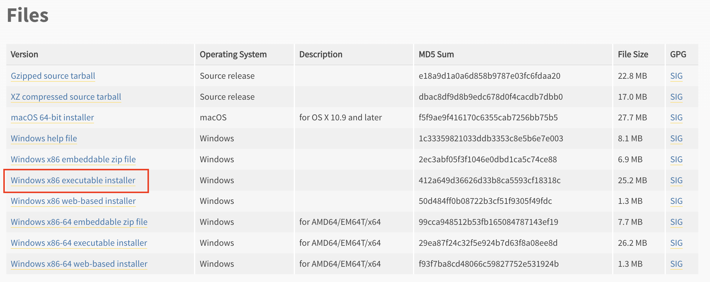
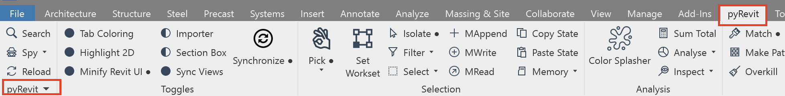
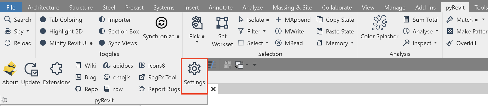
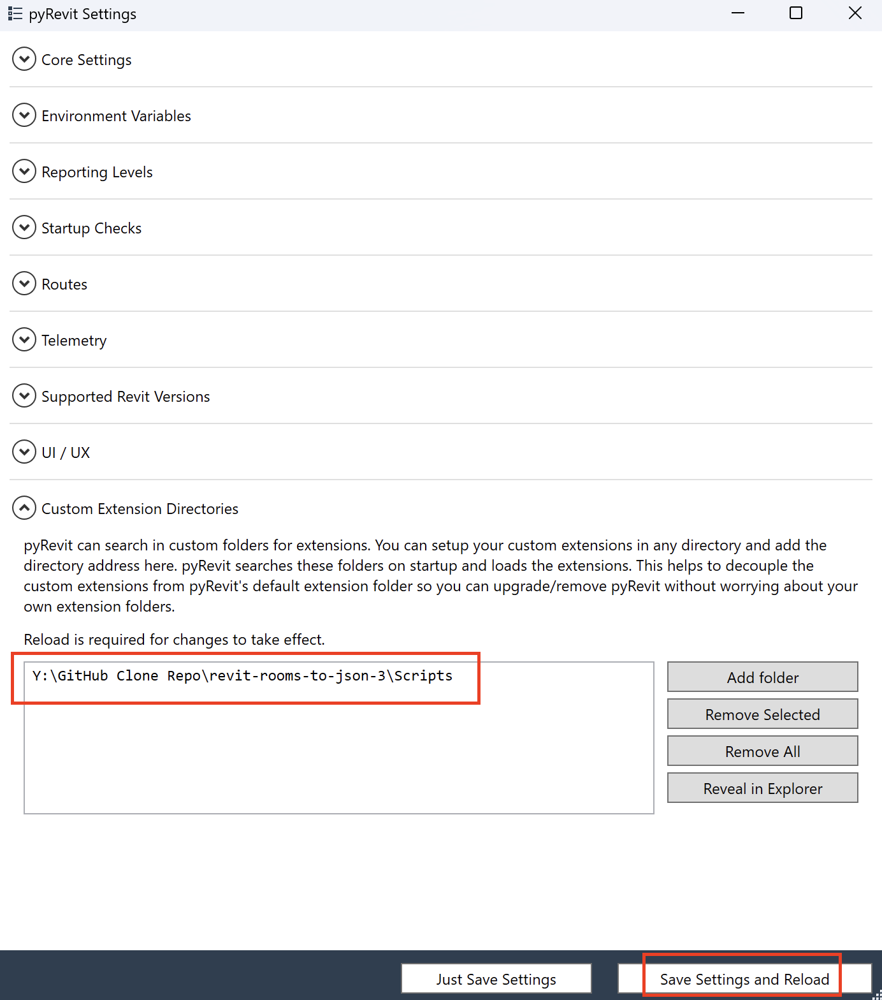
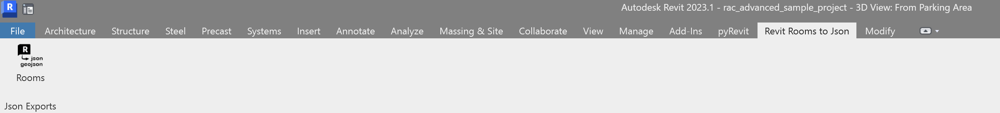
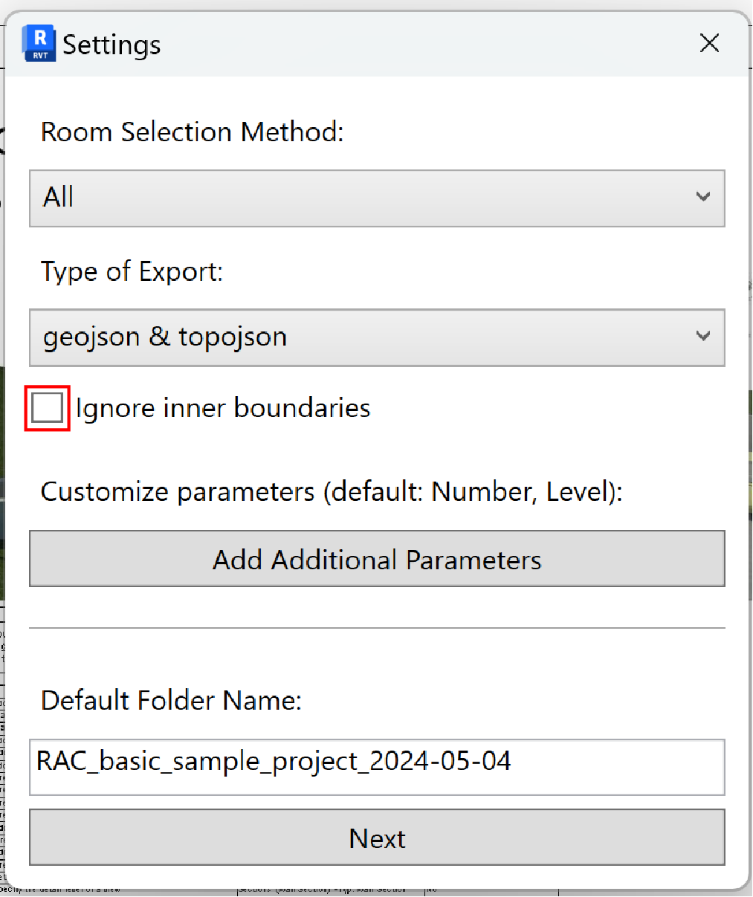
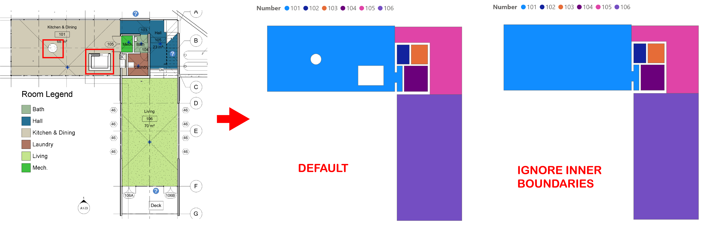

<!-- Improved compatibility of back to top link: See: https://github.com/othneildrew/Best-README-Template/pull/73 -->
<a name="readme-top"></a>
<!--
*** Thanks for checking out the Best-README-Template. If you have a suggestion
*** that would make this better, please fork the repo and create a pull request
*** or simply open an issue with the tag "enhancement".
*** Don't forget to give the project a star!
*** Thanks again! Now go create something AMAZING! :D
-->


<!-- PROJECT SHIELDS -->
<!--
*** I'm using markdown "reference style" links for readability.
*** Reference links are enclosed in brackets [ ] instead of parentheses ( ).
*** See the bottom of this document for the declaration of the reference variables
*** for contributors-url, forks-url, etc. This is an optional, concise syntax you may use.
*** https://www.markdownguide.org/basic-syntax/#reference-style-links
-->
[![Contributors][contributors-shield]][contributors-url]
[![Forks][forks-shield]][forks-url]
[![Stargazers][stars-shield]][stars-url]
[![Issues][issues-shield]][issues-url]
[![MIT License][license-shield]][license-url]
[![LinkedIn][linkedin-shield]][linkedin-url]


<!-- PROJECT LOGO -->
<br />
<div align="center">
  <a href="https://github.com/dolanklock/revit-rooms-to-json">
    
  </a>

<h3 align="center">Export Revit Room Boundaries to Json and GeoJson</h3>   
  <br />
</div>


<!-- TABLE OF CONTENTS -->
<details>
  <summary>Table of Contents</summary>
  <ol>
    <li>
      <a href="#about-the-project">About The Project</a>
      <ul>
        <li><a href="#built-with">Built With</a></li>
      </ul>
    </li>
    <li>
      <a href="#getting-started">Getting Started</a>
      <ul>
        <li><a href="#prerequisites">Prerequisites</a></li>
        <li><a href="#installation">Installation</a></li>
      </ul>
    </li>
    <li><a href="#usage">Usage</a></li>
    <li><a href="#contributing">Contributing</a></li>
    <li><a href="#license">License</a></li>
    <li><a href="#contact">Contact</a></li>
    <li><a href="#acknowledgments">Acknowledgments</a></li>
  </ol>
</details>


<!-- ABOUT THE PROJECT -->
## About The Project
A pyRevit add-in that exports room boundaries as well as specified room properties into .json (topojson) or .geojson files. The exported room information contains the "Number" and "Level" properties as default. This add-in allows users to use the exported Revit room plans to create data visualizations (such as for a Power BI report or a React app). For further information on the uses, visit the [Usage](#Usage) section.

*** Here's a blank template to get started: To avoid retyping too much info. Do a search and replace with your text editor for the following: `github_username`, *** `repo_name`, `twitter_handle`, `linkedin_username`, `email_client`, `email`, `project_title`, `project_description`

<p align="right">(<a href="#readme-top">back to top</a>)</p>


### Built With

* [![Python][Python]][Python-url] (version 3.8)
* [![Revit][Revit]][Revit-url] (Revit 2022+)

<p align="right">(<a href="#readme-top">back to top</a>)</p>


<!-- GETTING STARTED -->
## Getting Started
To get a local copy up and running follow these simple example steps.

<!-- ### Prerequisites -->
### Prerequisites
Install the required programs and software below
* pyRevit
  ```sh
  https://pyrevitlabs.notion.site/Install-pyRevit-98ca4359920a42c3af5c12a7c99a196d
  ```
* Python 3.8
  ```sh
  https://www.python.org/downloads/release/python-380/
  ```
  Go down to the "Files" section on the page and select / download the correct installer based on your operating system.
  For example, if you are on windows machine then you would select this installer - "Windows x86 executable installer" (see image below)

  

### Installation
1. Clone the repo. You need to clone the repository in order to get the a local copy of the repo on to your computer. Then 
   you can load this add-in in to Revit through pyRevit (see step 2)
   
2. How to clone a repository
   ```sh
   https://docs.github.com/en/repositories/creating-and-managing-repositories/cloning-a-repository
   ```
   After you clone the repository, go to pyRevit tab in Revit and select the pyRevit down arrow

   

   Select settings

   

   Select "Add Folder" and navigate to where you saved the cloned repository. You should navigate to the directory just before the .extensions folder and select ok.
   You should see a folder path something like this *Make sure the path is to the directory just before the .extensions directory. Select "Save Settings and Reload"

   
   
   You should now see the toolbar loaded!

   
3. Install packages
   #TODO: add instructions for virtual environment setup then install requirements packages there?
   ```sh
   pip install requirements.txt
   ```
   #TODO: add instructions for pip installing requirements file
   
4. Update environment variables
   #TODO: add steps for adding "PYTHONPATH" to environemnt variables. If create virtual environment will that affect where this is pathed to?? should path to venv?
   ```


<p align="right">(<a href="#readme-top">back to top</a>)</p>


<!-- USAGE EXAMPLES -->
## Usage
*This add-on was originaly designed to use Revit room geometries in Power BI reports, but can be applied to any program or script using geojson (.geojson) or topojson (.json) files.* 
<br>
<br>
Select rooms, export file type, and data exported (defaults to room Number and room Level):
<br>
**NOTE: "Ignore inner boundaries" is the option of simplifying the shape by ignoring inner boundaries** 
   
    
   
   
### 1. Power BI
* Use the add-on to export topojson files.
* **STEP 1: To import data from revit rooms into Power BI:**
    * Go to "Get data from another source" option, choose JSON, navigate to your topojson file and "Open". This should open the *Power Query Editor* window.
    * You will see an imported table, and some automatic steps created under "Applied Steps" on the right. Ignore this and go to Advanced Editor at the top Home ribbon.
        <br>
        --> replace the contents with the code below.
        <br>
        --> at the first row under "let" replace:
        **PATH TO TOPOJSON** and **TOPOSON FILE NAME**
        <br>
        --> at the last row under "let" replace at both instances:
        **{"Number","Level"}** by all Revit properties to be linked to the room plan.
  
```sh
let
    Source = Json.Document(File.Contents("PATH TO TOPOJSON\TOPOJSON FILE NAME.json")),
    #"Converted to Table" = Table.FromRecords({Source}),
    #"Removed Columns" = Table.RemoveColumns(#"Converted to Table",{"bbox", "arcs", "type"}),
    #"Expanded objects" = Table.ExpandRecordColumn(#"Removed Columns", "objects", {"object_name"}, {"object_name"}),
    #"Expanded object_name" = Table.ExpandRecordColumn(#"Expanded objects", "object_name", {"geometries"}, {"geometries"}),
    #"Expanded geometries" = Table.ExpandListColumn(#"Expanded object_name", "geometries"),
    #"Expanded geometries1" = Table.ExpandRecordColumn(#"Expanded geometries", "geometries", {"properties"}, {"properties"}),
    #"Expanded properties" = Table.ExpandRecordColumn(#"Expanded geometries1", "properties", {"Number", "Level"}, {"Number", "Level"})
in
    #"Expanded properties"
```
* **STEP 2: To link room geometries with data:**
    * Place a *Shape map* visual on the report. **NOTE:** At the time of this writing, *Shape map* visual is a beta feature, it must be enabled by checking its checkbox by going to File > Options and settings > Options > Preview features > Shape map visual (https://learn.microsoft.com/en-us/power-bi/visuals/desktop-shape-map)
    * In *Build visual*, the "Number" field should be dragged under "Location". Any distinct field can be used, as long as it can act as keys between the data and the room geometries.
    * In *Format your visual* go to Map settings > Map type > Custom map. Under *Add a map type* browse for your topojson file.
    * Go back to *Build visual* to link additional data to the floor plan. For example, drag the "Area" field under "Color saturation".
 ---
**EXAMPLE**<br>
Fields exported from Revit include Number, Level, and Area. Area was converted to a decimal number type of data in the *Table view* and used in the slicer visual. The slicer is adujsted to highlight rooms matching the specified area range.

<br>
**For more information regarding the *Shape map* visual go to**
>https://learn.microsoft.com/en-us/power-bi/visuals/desktop-shape-map

  **NOTE: Data coming from any external source can be linked to the floor plan (i.e imported data from an excel), as long as there is a column field in that external data that will act as the linking key with the field specified under "Location" under *Build visual*.<br>
For example, an external source containing a Number column that correlates with the topjson Number field dragged under "Location"**

---   
### 2. React JS
* Use the add-on to export topojson files.
* Import geojson files to react applications using react leaflet
>https://react-leaflet.js.org/
>https://stackoverflow.com/questions/60470752/importing-geojson-file-to-react-leaflet   

<p align="right">(<a href="#readme-top">back to top</a>)</p>


<!-- CONTRIBUTING -->
## Contributing

Contributions are what make the open source community such an amazing place to learn, inspire, and create. Any contributions you make are **greatly appreciated**.

If you have a suggestion that would make this better, please fork the repo and create a pull request. You can also simply open an issue with the tag "enhancement".
Don't forget to give the project a star! Thanks again!

1. Fork the Project
2. Create your Feature Branch (`git checkout -b feature/AmazingFeature`)
3. Commit your Changes (`git commit -m 'Add some AmazingFeature'`)
4. Push to the Branch (`git push origin feature/AmazingFeature`)
5. Open a Pull Request

<p align="right">(<a href="#readme-top">back to top</a>)</p>


<!-- LICENSE -->
## License

Distributed under the MIT License. See `LICENSE.txt` for more information.

<p align="right">(<a href="#readme-top">back to top</a>)</p>


<!-- CONTACT -->
## Contact

Your Name - [@twitter_handle](https://twitter.com/twitter_handle) - email@email_client.com

Project Link: [https://github.com/github_username/repo_name](https://github.com/github_username/repo_name)

<p align="right">(<a href="#readme-top">back to top</a>)</p>


<!-- ACKNOWLEDGMENTS -->
## Acknowledgments

* []()
* []()
* []()

<p align="right">(<a href="#readme-top">back to top</a>)</p>


<!-- MARKDOWN LINKS & IMAGES -->
<!-- https://www.markdownguide.org/basic-syntax/#reference-style-links -->
[contributors-shield]: https://img.shields.io/github/contributors/github_username/repo_name.svg?style=for-the-badge
[contributors-url]: https://github.com/github_username/repo_name/graphs/contributors
[forks-shield]: https://img.shields.io/github/forks/github_username/repo_name.svg?style=for-the-badge
[forks-url]: https://github.com/github_username/repo_name/network/members
[stars-shield]: https://img.shields.io/github/stars/github_username/repo_name.svg?style=for-the-badge
[stars-url]: https://github.com/github_username/repo_name/stargazers
[issues-shield]: https://img.shields.io/github/issues/github_username/repo_name.svg?style=for-the-badge
[issues-url]: https://github.com/github_username/repo_name/issues
[license-shield]: https://img.shields.io/github/license/github_username/repo_name.svg?style=for-the-badge
[license-url]: https://github.com/github_username/repo_name/blob/master/LICENSE.txt
[linkedin-shield]: https://img.shields.io/badge/-LinkedIn-black.svg?style=for-the-badge&logo=linkedin&colorB=555
[linkedin-url]: https://linkedin.com/in/linkedin_username
[product-screenshot]: images/screenshot.png
[Next.js]: https://img.shields.io/badge/next.js-000000?style=for-the-badge&logo=nextdotjs&logoColor=white
[Next-url]: https://nextjs.org/
[React.js]: https://img.shields.io/badge/React-20232A?style=for-the-badge&logo=react&logoColor=61DAFB
[React-url]: https://reactjs.org/
[Vue.js]: https://img.shields.io/badge/Vue.js-35495E?style=for-the-badge&logo=vuedotjs&logoColor=4FC08D
[Vue-url]: https://vuejs.org/
[Angular.io]: https://img.shields.io/badge/Angular-DD0031?style=for-the-badge&logo=angular&logoColor=white
[Angular-url]: https://angular.io/
[Svelte.dev]: https://img.shields.io/badge/Svelte-4A4A55?style=for-the-badge&logo=svelte&logoColor=FF3E00
[Svelte-url]: https://svelte.dev/
[Laravel.com]: https://img.shields.io/badge/Laravel-FF2D20?style=for-the-badge&logo=laravel&logoColor=white
[Laravel-url]: https://laravel.com
[Bootstrap.com]: https://img.shields.io/badge/Bootstrap-563D7C?style=for-the-badge&logo=bootstrap&logoColor=white
[Bootstrap-url]: https://getbootstrap.com
[JQuery.com]: https://img.shields.io/badge/jQuery-0769AD?style=for-the-badge&logo=jquery&logoColor=white
[JQuery-url]: https://jquery.com
[Revit]:https://img.shields.io/badge/Revit-blue?logo=autodeskrevit&logoColor=%23186BFF&logoSize=auto&color=white
[Revit-url]:https://www.autodesk.com/ca-en/products/revit/overview?term=1-YEAR&tab=subscription
[python]: https://img.shields.io/badge/Python-blue?logo=python&logoColor=%233776AB&logoSize=auto&color=white
[python-url]:https://www.python.org/downloads/release/python-380/
